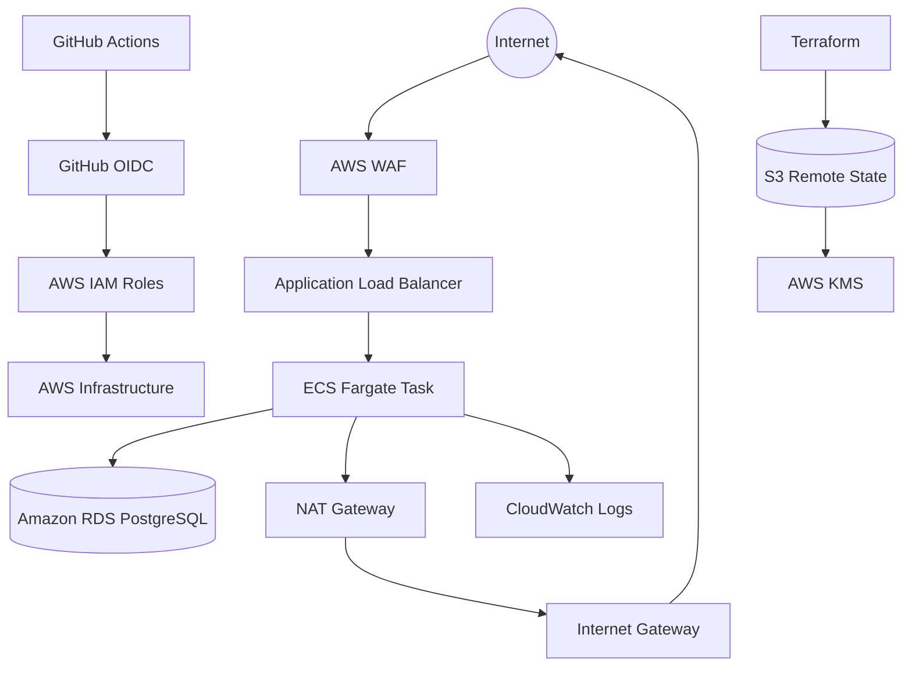

# AWS ECS Fargate Infrastructure with Terraform

Production-style AWS infrastructure deployment using **Terraform, Amazon ECS Fargate, Application Load Balancer, Amazon RDS, AWS WAF, CloudWatch, GitHub Actions, Trivy, Prowler, and GitHub OIDC**.

The project demonstrates a complete Infrastructure-as-Code and CI/CD workflow where infrastructure changes are validated and security-scanned during Pull Requests, then automatically deployed to AWS after merging into the `main` branch.

---

## Architecture



### Network Architecture

```text
                           Internet
                              |
                         AWS WAF
                              |
                     Public ALB :80
                              |
                    -----------------
                    |               |
              Public Subnet   Public Subnet
                    |
               ALB Listener
                    |
                  :8080
                    |
          -----------------------
          |                     |
   Private App Subnet    Private App Subnet
          |
      ECS Fargate
          |
          | :5432
          |
      RDS PostgreSQL
          |
   Private DB Subnets

ECS Fargate
     |
     | HTTPS :443
     |
 NAT Gateway
     |
Internet Gateway
     |
Public Internet
```

---

## Project Highlights

- AWS infrastructure provisioned entirely using **Terraform**
- Modular Terraform architecture
- Multi-AZ VPC design
- Public and private subnet segmentation
- ECS Fargate workloads deployed without public IP addresses
- Application Load Balancer for external traffic
- Private Amazon RDS PostgreSQL database
- Security-group-based service isolation
- AWS WAF protection for the public application endpoint
- CloudWatch centralized container logging
- AWS Secrets Manager managed database credentials
- Terraform remote state stored in Amazon S3
- Customer-managed AWS KMS encryption for Terraform state
- GitHub Actions CI/CD pipeline
- Passwordless AWS authentication using GitHub OIDC
- Separate IAM roles for Terraform Plan, Terraform Apply, and Prowler
- Trivy Infrastructure-as-Code security scanning
- Prowler AWS security assessment after deployment
- Automated ALB smoke testing after deployment

---

## AWS Services Used

| Service | Purpose |
|---|---|
| Amazon VPC | Network isolation and subnet architecture |
| Amazon ECS | Container orchestration |
| AWS Fargate | Serverless container compute |
| Application Load Balancer | Public traffic distribution |
| Amazon RDS | Managed PostgreSQL database |
| AWS WAF | Web application protection |
| Amazon CloudWatch | ECS application logging |
| AWS Secrets Manager | RDS credential management |
| Amazon S3 | Terraform remote state storage |
| AWS KMS | Terraform state encryption |
| AWS IAM | Service and CI/CD permissions |
| GitHub OIDC | Passwordless AWS authentication |
| NAT Gateway | Outbound connectivity for private ECS tasks |
| Internet Gateway | Public subnet internet connectivity |

---

## Terraform Project Structure

```text
.
├── .github/
│   └── workflows/
│       ├── terraform-ci.yml
│       └── deploy.yml
│
├── terraform/
│   │
│   ├── bootstrap/
│   │   ├── main.tf
│   │   ├── variables.tf
│   │   ├── outputs.tf
│   │   └── terraform.tfvars.example
│   │
│   ├── environments/
│   │   └── dev/
│   │       ├── main.tf
│   │       ├── variables.tf
│   │       ├── outputs.tf
│   │       ├── backend.tf
│   │       └── dev.tfvars
│   │
│   └── modules/
│       ├── alb/
│       ├── ecs/
│       ├── iam/
│       ├── rds/
│       ├── security-groups/
│       ├── vpc/
│       └── waf/
│
├── .gitignore
├── .trivyignore
└── README.md
```

---

# Infrastructure Design

## VPC

The environment uses a dedicated VPC distributed across two Availability Zones.

```text
VPC: 10.20.0.0/16

Public Subnets
├── 10.20.1.0/24
└── 10.20.2.0/24

Private Application Subnets
├── 10.20.10.0/24
└── 10.20.11.0/24

Private Database Subnets
├── 10.20.20.0/24
└── 10.20.21.0/24
```

The public subnets host the Application Load Balancer and NAT Gateway.

ECS Fargate tasks are deployed into private application subnets.

Amazon RDS is deployed into isolated private database subnets.

---

## Security Groups

Traffic is restricted using security-group references instead of unnecessarily exposing internal services.

```text
Internet
   |
   | TCP 80
   v
ALB Security Group
   |
   | TCP 8080
   v
ECS Security Group
   |
   | TCP 5432
   v
RDS Security Group
```

ECS outbound internet access is restricted to HTTPS:

```text
ECS → TCP 443 → NAT Gateway → Internet
```

This allows private Fargate tasks to reach required external endpoints while keeping the containers inaccessible directly from the public internet.

---

## ECS Fargate

The application workload runs using Amazon ECS with the Fargate launch type.

Configuration includes:

- Private subnets
- No public IP assignment
- ECS Cluster Container Insights
- CloudWatch logging
- Dedicated ECS task execution IAM role
- Application Load Balancer integration
- Target type `ip`
- Container port `8080`

The demonstration workload uses:

```text
nginxinc/nginx-unprivileged:alpine
```

This project focuses on the AWS infrastructure and delivery platform rather than application development.

---

## Application Load Balancer

The Application Load Balancer is deployed across the two public subnets.

```text
Internet
    |
    v
AWS WAF
    |
    v
ALB :80
    |
    v
Target Group :8080
    |
    v
ECS Fargate
```

The target-group health check is configured against:

```text
/
```

with successful HTTP status codes:

```text
200-399
```

---

## Amazon RDS

PostgreSQL is deployed into private database subnets and cannot be accessed directly from the public internet.

Key controls include:

- Private database subnets
- No public accessibility
- Storage encryption
- Security-group isolation
- Credentials managed by AWS Secrets Manager
- Access permitted only from the ECS security group

Traffic flow:

```text
ECS Security Group
        |
        | TCP 5432
        v
RDS Security Group
```

---

## AWS WAF

AWS WAF is associated with the Application Load Balancer.

The Web ACL includes protections such as:

- AWS Managed Common Rule Set
- AWS IP Reputation List
- Request rate limiting

This provides an additional security layer before requests reach the load balancer.

---

# Terraform State Security

Terraform state is stored remotely in Amazon S3.

The bootstrap configuration provisions:

- S3 state bucket
- S3 versioning
- Block Public Access
- Customer-managed KMS key
- KMS automatic key rotation
- S3 Bucket Keys
- IAM permissions for CI/CD state access

```text
Terraform
    |
    v
S3 Remote State
    |
    v
Customer Managed KMS Key
```

The state bucket is not publicly accessible.

Sensitive Terraform state files are not stored in the Git repository.

---

# GitHub OIDC Authentication

The project does not store long-lived AWS access keys in GitHub.

GitHub Actions authenticates to AWS using **OpenID Connect (OIDC)**.

```text
GitHub Actions
      |
      | OIDC Token
      v
AWS IAM Identity Provider
      |
      v
Assume IAM Role
      |
      v
Temporary AWS Credentials
```

Three separate IAM roles are used.

### Terraform Plan Role

Used by Pull Request CI.

Provides:

- Terraform state read access
- State lock management
- AWS infrastructure read permissions
- KMS access required for encrypted Terraform state

### Terraform Apply Role

Used by the deployment pipeline.

Provides permissions required to create and manage the project infrastructure.

### Prowler Role

A separate read-only security assessment role using AWS-managed:

```text
SecurityAudit
ViewOnlyAccess
```

This separates infrastructure deployment permissions from security auditing permissions.

---

# CI/CD Pipeline

The repository uses separate CI and CD workflows.

## Pull Request — Continuous Integration

Every Pull Request targeting `main` runs:

```text
Feature Branch
      |
      v
Pull Request
      |
      +---- Terraform Format Check
      |
      +---- Terraform Init
      |
      +---- Terraform Validate
      |
      +---- Trivy IaC Scan
      |
      +---- GitHub OIDC
      |
      +---- Terraform Plan
      |
      v
Merge Allowed
```

The workflow performs:

```bash
terraform fmt -check -recursive
terraform validate
terraform plan
```

along with a Trivy security scan.

No infrastructure is deployed during the Pull Request workflow.

---

## Main Branch — Continuous Deployment

After the Pull Request passes CI and is merged into `main`:

```text
Merge to main
      |
      v
GitHub Actions CD
      |
      +---- GitHub OIDC Authentication
      |
      +---- Terraform Init
      |
      +---- Terraform Plan
      |
      +---- Terraform Apply
      |
      +---- Prowler AWS Security Scan
      |
      +---- Upload Security Report
      |
      +---- ALB Smoke Test
      |
      v
Deployment Complete
```

This demonstrates a controlled:

```text
Branch
  ↓
Pull Request
  ↓
Validation
  ↓
Security Scan
  ↓
Review / Merge
  ↓
Deployment
  ↓
Cloud Security Assessment
  ↓
Application Verification
```

workflow.

---

# Security Scanning

## Trivy

Trivy scans the Terraform configuration during Pull Requests.

The pipeline checks for:

```text
HIGH
CRITICAL
```

Infrastructure-as-Code misconfigurations.

The workflow fails when an unapproved HIGH or CRITICAL finding is detected.

### Documented Exceptions

Some findings are intentional architecture decisions for this demonstration environment.

#### AWS-0104 — ECS HTTPS Egress

Private ECS tasks require HTTPS outbound connectivity through the NAT Gateway.

```text
ECS Private Subnet
       |
       v
NAT Gateway
       |
       v
HTTPS :443
```

#### AWS-0053 — Public Load Balancer

The Application Load Balancer is intentionally internet-facing because it is the public entry point to the application.

#### AWS-0054 — HTTP Listener

The demonstration environment currently does not use a custom domain.

A production deployment would use:

```text
Route 53 / Custom Domain
          |
          v
ACM TLS Certificate
          |
          v
HTTPS :443
          |
          v
Application Load Balancer
```

and redirect:

```text
HTTP :80 → HTTPS :443
```

These exceptions are documented in `.trivyignore`.

---

## Prowler

After successful deployment, the CD pipeline runs Prowler against the AWS environment using a separate read-only IAM role.

Prowler evaluates the AWS account and deployed resources for cloud security configuration issues.

Reports are generated in:

```text
CSV
JSON-OCSF
```

and uploaded as GitHub Actions artifacts for later analysis.

---

# Automated Smoke Test

After Terraform deployment and the Prowler scan, the pipeline validates the deployed workload through the Application Load Balancer.

The workflow performs an HTTP request against:

```text
http://<ALB-DNS>/
```

The deployment is considered successful only when the load balancer can reach a healthy ECS task.

---

# Git Workflow

Development follows a feature-branch workflow.

```bash
git checkout -b feature/example-change
```

Make infrastructure changes and push:

```bash
git add .
git commit -m "Update AWS infrastructure"
git push -u origin feature/example-change
```

Then create a Pull Request:

```text
feature/example-change
        ↓
       main
```

CI validates the infrastructure before merge.

After successful checks and review:

```text
PR Merge
   ↓
main
   ↓
Automatic AWS Deployment
```

---

# Deployment

## Prerequisites

Install:

- Terraform
- AWS CLI
- Git
- GitHub CLI (optional)
- An AWS account
- A GitHub repository

Authenticate the AWS CLI locally before creating the bootstrap infrastructure.

Verify:

```bash
aws sts get-caller-identity
```

---

## 1. Bootstrap AWS

The bootstrap stack creates the infrastructure required by GitHub Actions and Terraform remote state.

Create:

```text
terraform/bootstrap/terraform.tfvars
```

using:

```text
terraform/bootstrap/terraform.tfvars.example
```

Then:

```bash
cd terraform/bootstrap

terraform init
terraform validate
terraform plan -var-file="terraform.tfvars"
terraform apply -var-file="terraform.tfvars"
```

Bootstrap outputs provide values required for the GitHub repository variables.

---

## 2. Configure GitHub Variables

Configure the following GitHub repository variables:

```text
AWS_REGION
AWS_TERRAFORM_PLAN_ROLE_ARN
AWS_TERRAFORM_APPLY_ROLE_ARN
AWS_PROWLER_ROLE_ARN
TF_VERSION
```

No permanent AWS access key or secret access key is required.

---

## 3. Create a Feature Branch

```bash
git checkout -b feature/infrastructure-change
```

Push the branch:

```bash
git push -u origin feature/infrastructure-change
```

Open a Pull Request against:

```text
main
```

The CI workflow automatically runs.

---

## 4. Merge the Pull Request

Once CI passes, merge the Pull Request.

The merge generates a push event against `main`, automatically triggering the deployment workflow.

---

# Destroying the Environment

The development infrastructure should be destroyed when it is no longer required to avoid unnecessary AWS charges.

```bash
cd terraform/environments/dev

terraform destroy -var-file="dev.tfvars"
```

This removes resources such as:

- ECS
- RDS
- ALB
- NAT Gateway
- WAF
- CloudWatch resources
- VPC infrastructure

Bootstrap infrastructure can also be removed separately when the CI/CD environment is no longer required.

> The bootstrap stack contains the Terraform remote state infrastructure and GitHub OIDC roles. Destroying it disables GitHub Actions authentication until the bootstrap resources are recreated.

---

# Security Design Summary

| Security Control | Implementation |
|---|---|
| Workload isolation | ECS in private subnets |
| Database isolation | RDS in private DB subnets |
| Public exposure | Only ALB exposed |
| Container ingress | Allowed only from ALB SG |
| Database ingress | Allowed only from ECS SG |
| AWS authentication | GitHub OIDC |
| Long-lived AWS keys | Not used |
| Terraform state | Remote S3 backend |
| State encryption | Customer-managed KMS key |
| Secret management | AWS Secrets Manager |
| Application protection | AWS WAF |
| IaC scanning | Trivy |
| Cloud security assessment | Prowler |
| Container logs | CloudWatch |
| Deployment verification | Automated ALB smoke test |

---

# What This Project Demonstrates

This project demonstrates hands-on experience with:

- AWS networking and VPC design
- Amazon ECS Fargate
- Application Load Balancers
- Amazon RDS
- AWS WAF
- IAM and least-privilege role separation
- GitHub OIDC federation
- Terraform modules
- Terraform remote state
- AWS KMS
- GitHub Actions CI/CD
- Infrastructure security scanning
- AWS cloud security assessment
- Private workload architecture
- Automated infrastructure deployment and validation

---

# Future Improvements

Potential production enhancements include:

- Custom domain using Amazon Route 53
- ACM TLS certificate
- HTTPS ALB listener
- HTTP-to-HTTPS redirection
- Amazon ECR for private container images
- VPC endpoints for AWS services
- Multi-AZ RDS
- AWS CloudTrail
- AWS Config
- Amazon GuardDuty
- AWS Security Hub
- Automated policy checks using OPA/Checkov
- Separate development, staging, and production environments
- Terraform state bootstrap lifecycle improvements

---

# Deployment Result

The complete pipeline was validated successfully:

```text
Terraform CI                 ✅
Trivy IaC Security Scan      ✅
Terraform Plan               ✅
GitHub OIDC Authentication   ✅
Terraform Apply              ✅
ECS Fargate Deployment       ✅
RDS Deployment               ✅
AWS WAF Association          ✅
Prowler AWS Security Scan    ✅
ALB Smoke Test               ✅
Application Reachability     ✅
```

---

## Author

**Shreekantha Puranika S**

AWS Cloud / DevOps / Cloud Security

---

## Disclaimer

This project is designed as a hands-on AWS infrastructure and cloud security portfolio project.

Some architecture decisions are optimized for demonstration and learning purposes. Production environments should additionally implement organization-specific controls, monitoring, compliance requirements, high availability, TLS, backup policies, and disaster recovery.